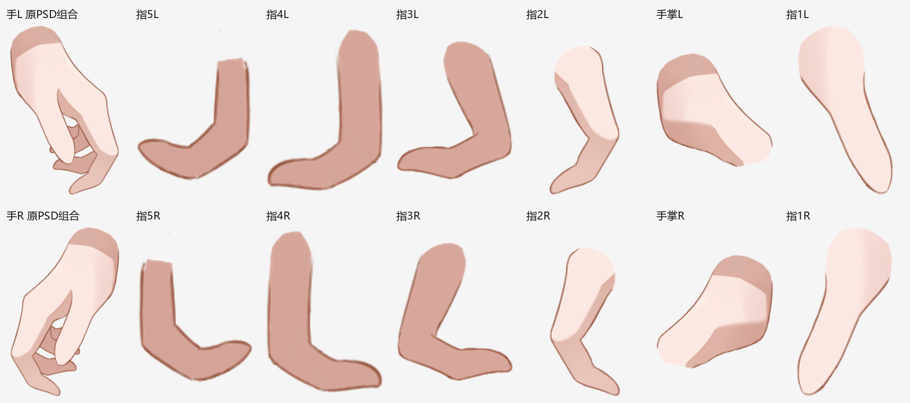
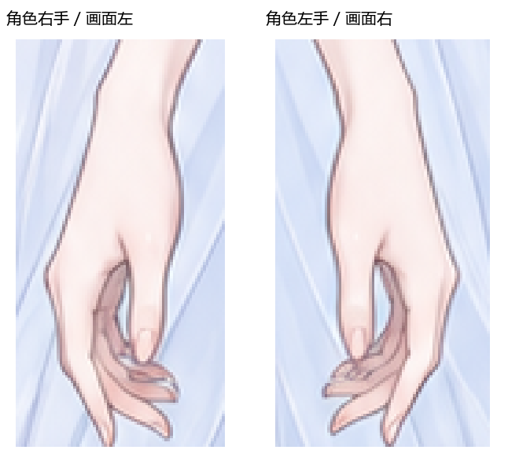

# arms 制作规划：双臂整体制作，手部单独补全

日期：2026-09-27；已按本规划建立[arms五步模板](../templates/部件专项/arms)，接入lower_body之后，本次未启动绘制。

## 结论

lower_body之后做arms合适：身体侧肩根已有接口，可以接续双臂，再由专门的手部绘制者处理腕部、手掌和十根手指。保留当前六个顶层part，在左右hand内部各展开完整手掌与五指；大小臂按一次任务完成，手部按线稿补全、着色两个任务复用同一专门会话。

共五个实际任务：手臂与手部色盘 → 双臂构型与着色 → 手部补全参考 → 双手结构线稿 → 双手着色、承影与成稿；只有手部线稿之后一次独立结构审查。手部补全参考由imagegen生成一次，大小臂直接依据原图与现有身体接口制作；自身明暗在着色中完成，独立投影与高光在相应绘制任务的收尾处理，沿用已有流程的承影分工。

## 1. Milly原始素材实际怎样拆

本次直接读取了用户提供的[Milly原画.psd](C:/Users/22129/Downloads/米粒模型配布4.1版本用/Milly原画.psd)，画布3200×4800，未修改原文件。

| 原PSD内容 | 实际层级 | 对本轮的启发 |
| --- | --- | --- |
| 左臂、右臂 | 各含大臂、小臂、手组，以及袖子前后、腕带前后 | 身体、手臂与穿戴物保持各自身份；穿戴物的前后片服务于穿插 |
| 手L、手R | 每组恰好6个像素图层：手掌、指1～指5 | 每根手指可以独立控制，不必默认拆成14个指节 |
| 默认手形 | 五指按原有弯曲姿态绘制，藏在掌后的指根仍有延伸 | 补全要保留原姿态的完整部件，不能只保留当前露出的指尖/细条 |
| 默认叠放 | 后侧指5、4、3、2，手掌，前侧指1 | 拇指与四指不必位于同一层序，组合形状靠真实覆盖关系形成 |

下图从PSD像素层直接提取；各独显格为便于查看分别缩放，不能拿格间尺寸量测指长，原位置与包围盒见[图层清单](../../../../analysis/arms-planning-20260927/milly-arm-layers.json)。

原模型[Milly.cdi3.json](C:/Users/22129/Downloads/米粒模型配布4.1版本用/MillyRuntime/Milly.cdi3.json)另外列有左右手开合、腕部方向及左右各五个Finger参数；参数表证明这些控制被声明，本次没有运行原模型验证每个参数的实际变形范围。

仓库的[SVG动画演示](../../../../rigging/milly/README.md)则明确没有单指参数，[v3 limbWarp](../../../../rigging/milly/v3/rig.js)主要按位置统一变形整手、腕、肘与肩；因此本轮的五指结构参考原PSD，不能直接认为现有SVG演示已经支持十指独立弯曲。

## 2. 教程和当前角色给出的边界

[拆分总原则](../../../../live2d-tutorial-text/2.部件拆分总原则.txt)要求从大到小、先拆后补；[手臂教程](../../../../live2d-tutorial-text/12.手臂细节拆分.txt)明确大臂、小臂、手，手可再分手掌与五指，通常每指独立已足够，更精确需求才逐指节拆分；[精细度原则](../../../../live2d-tutorial-text/13.判断拆分与否.txt)还把独立变形、层序、显隐与剪贴关系都视为拆分依据。

当前[jianma_v4清单](../../../../outputs/jianma_v4/structure/parts.yaml)已经有upper_arm_left/right、forearm_left/right、hand_left/right，且说明手指内部拆分留给专项；这次不改变外层kind，也不把袖子、手环、头发等邻件并入arms。

原图双手自然下垂、手指弯曲且重叠，不能把眼前可见的几条弧线当成全部手指；需要辨认每指从掌根到指尖的连续走向、指间负形与前后关系，并补出掌内隐藏根部。

## 3. 五个任务如何执行

| 步骤 | 模型与职责 | 制作顺序、边界和交付 |
| --- | --- | --- |
| 1. 手臂与手部色盘 | 独立Sol-medium，arms_palette | 从原图取双臂/手掌/指节/甲面及投影的实际颜色，读取body肩口接口色；隐藏肤色单列推断；交palette.png/JSON，不改SVG |
| 2. 双臂构型与着色 | Astra-xhigh，refinement_drawing | 两侧大臂、小臂一起处理：先对原图校准肩肘腕比例与搭接，再完成自然轮廓、完整底色和自身体积，收尾制作落在大小臂上的独立投影及必要高光；交完整SVG，留下实际腕口位置/方向/颜色 |
| 3. 手部完整线稿与补全参考 | imagegen，一次 | 以原图双手特写为形状依据，参考Milly六件拆法，生成双手保持原姿态的完整组合线稿及掌/五指补全图；交一张参考板，不生成动作集 |
| 4. 双手结构线稿与隐藏补全 | 专门的新Astra-xhigh会话，hands_drawing | 沿用步骤2整图，校准两手的掌形、指长、指节走向与空隙；各完成掌与五指完整实体、腕口/指根搭接和必要控制点；交完整SVG及一张结构对照，之后做唯一一次独立线稿review |
| 5. 双手着色、承影与成稿 | 继续hands_drawing同一会话 | 按已确认结构完成掌部、五指、指甲及自身明暗，腕部接续小臂，再制作落在掌面/手指上的独立投影及必要高光；一次自查后交最终SVG、预览与一张对照，直接成为carry |

两个绘制会话通过完整SVG、实际接口与色盘接续；手部绘制者不重做已完成大小臂，也不把十根手指变成十次派发。第4步review只聚焦真实结构、补全与自然线质，明确问题返回同一hands_drawing局部修改；第5步不另设review或组装节点，总控接收交付即可。

色盘工具沿用公共extract_palette.py，手臂入口只提供可覆盖的展示名称；位置、采样方法、数量和颜色分类仍由模型按原图决定。

### 承影职责沿用前序流程

[face第6步](../templates/部件专项/face/6.投影与高光效果/提示词.txt)、[body第5步](../templates/部件专项/body/5.身体承影与成稿/提示词.txt)都先完成自身着色，再对照原图处理落在本组表面上的投影与必要独立高光；[mouth第3步](../templates/部件专项/mouth/3.嘴部着色成稿/提示词.txt)把这两段操作放在同一任务内顺序执行。arms按这个分工明确制作内容，取色任务不新增全局光源分析、lighting计划或动作投影判定。

| 内容 | 制作归属 |
| --- | --- |
| 大小臂的转面、手掌和指节的体积、普通柔亮 | 步骤2/5的自身着色 |
| 衣物/头发/配饰等落在大小臂上的实际投影 | 步骤2收尾，目标为对应upper_arm/forearm |
| 指投指、指投掌，以及外物落在手部的实际投影 | 步骤5收尾，目标为对应hand内部承影面，来源指与目标指/掌分别记录 |
| 需要独立控制的手臂/手部高光 | 随对应区域的效果制作，不将所有普通受光拆成独立效果 |
| 已由body/hair等阶段制作、承载在其表面上的影 | 沿用原效果和归属，不因进入arms重判或重复新建 |
| 手抬到身体前等新动作才会产生的影 | 后续绑定/关联阶段按实际动作处理，本轮不预画 |

当前完整SVG已存在手、大小臂投在后发上的效果，仍归hair；若本轮校形改变了这些既有影实际引用的源形，只维护受影响的原引用/源形与效果，保持原id、承影归属和已成立关系，不重新评估所有外部承影面或另画第二套。这是既有效果的依赖修正，与新增一轮全身光影判断分开。

步骤2/5的效果操作顺序仍为：读取本区已有效果并去重 → 按原图制作本区缺少的独立投影/高光 → 保留完整效果路径并按实际承影面裁切 → 复用成稿对照做代表性开关自查；没有实际效果就说明无需制作，不为部件凑影，也不增独立光影审查。

## 4. 生图参考具体解决什么

生图的主要用途是澄清当前遮挡手形的完整结构，尤其是藏在掌后和其它手指后的连续形状；不会把生成结果直接当作SVG或准确解剖测量值。

参考板包含两个用途明确的区域：

- **组合线稿**：双手保留原图视角、腕部倾斜、掌形、各指弯曲方向及指间空隙，放大到可辨认指节；左右分别观察，不把两手都改成统一张掌姿势。
- **补全图**：每手显示手掌与拇、食、中、无名、小指，按同一比例平移排开，各指仍保持组合图的弯曲姿态，补足被掌或邻指遮住的根部和侧缘，用浅虚线区别推断区域；腕部仅作接续参照。

给生图模型的是自然语言绘画要求与实际参考图，不传它无法解释的流程变量；Milly图只解释拆分方式，不复制其人物手形、色块风格或层数之外的造型。

绘制者仍以原图校准可见部分，生成图若出现多指、少指、错向、重复指尖或手形变化，不能照抄；局部能判断的错误在线稿中修正，确实无法辨认的隐藏结构明确为推断。默认不生成每个指节、多个动作或额外多视图；大幅翻掌/握拳属于后续指定动作时的针对性补图需求。

## 5. 手部必须真的补全哪些内容

| 部件 | 本轮需完成的实体 | 绘制时容易遗漏的点 |
| --- | --- | --- |
| 手掌 | 从腕口到五指根部的完整掌面及拇指根相接体积 | 移开拇指/四指后掌面不能空洞，掌底也不能残留另一根手指的轮廓或颜色 |
| 拇指 | 从掌侧根部到指尖的完整形状 | 拇指根部及转轴不同于四指，不能沿用同一条掌指关节线 |
| 食指/中指/无名指/小指 | 每指各一条完整、连续、可编辑的形体及根部覆盖余量 | 不把三个后侧指尖合成一块深色扇形，不把看不见的指根省掉 |
| 指甲和关节细节 | 归属实际手指并跟随对应末端/表面 | 不留在整手固定图层，辅助关节线不变成硬圈，色面不吞掉指缝 |
| 指间投影 | 有依据时独立，记录真实来源指与承影指/掌 | 阴影不烙在邻指底色，移开来源后才能单独调整，不用黑三角填满真实空隙 |

指根/腕口采用圆顺搭接，完整实底与可见描边分开：闭合路径负责填充，隐藏封口不描墨线；掌背、指节和甲面先按原图安排宽窄受光，再做低对比局部转折，保留细节但不均匀描出每个关节。

层序依据这张角色原图，而不是固定照搬Milly；同一根指确有跨掌前后穿插时，可以分绘制片段但仍归同一手指控制，不为每个色区新增动画实体。

## 6. 为程序化运动提前准备什么

### 6.1 运动链与绘制层序分别保存

逻辑运动链为body肩口 → 大臂 → 小臂 → hand腕口 → 手掌及五指；肩的运动带动整条臂，肘带动小臂和手，腕带动整手，各手指另有根部与弯曲控制。

这条父子链不应直接把所有绘制节点永久嵌在大臂后层：小臂和手会跨到身体前方，手指之间也有覆盖变化，因此保留稳定实体id，用绑定数据表达运动继承，绘制顺序单独处理；小臂通常在大臂前，实际姿态存在例外。

### 6.2 接点相同，仅重叠还不够

| 接口 | 素材阶段 | 后续程序绑定 |
| --- | --- | --- |
| 身体—大臂 | 接body现有肩坡/肩窝，留小范围完整搭接，不画肩帽封口 | 接触带共享位置与变形权重，从身体过渡到大臂，避免肩动时牵坏颈部 |
| 大臂—小臂 | 圆顺肘端、足够遮挡延续，内外侧轮廓分清 | 同一肘中心及相接控制点，肘窝压缩/外侧展开有过渡，避免两个刚性矩形旋转 |
| 小臂—手掌 | 小臂与手掌各有完整腕口，交接同一位置、宽度和方向 | 共用腕中心和接触带，手转动时连线、底色和材质一起接续 |
| 手掌—手指 | 完整掌面、完整指根、虎口和指间根部合理补全 | 每指独立根部控制，近根处与掌共享变形；沿指长弯曲，不只整根刚性旋转 |

项目此前的[接缝根因记录](../../../../rigging/milly/v3/evidence/root-cause-review/ROOT-CAUSE.md)已发现：隐藏封口墨线外露，以及接触点分属不同深度/变形场，会分别造成接缝；单纯增加重叠或调层序不能保证动画连续。

Cubism的Glue会绑定两个ArtMesh的重合顶点，并通过权重控制相互影响；程序化SVG需要实现相应的共享接点/权重过渡，不能以两层相邻就视为已经绑定。[Live2D官方Glue说明](https://docs.live2d.com/en/cubism-editor-manual/glue/)

### 6.3 少量、可读取的控制信息

建议在实际SVG的metadata中保存同一viewBox坐标系下的关节/接口信息，与实体id对应：左右肩肘腕、各指根、关键弯折点和指尖，以及相接部件、接触带、默认覆盖关系；顶层data-part身份保持稳定，手内使用palm/thumb/index/middle/ring/pinky等语义id。

这些是后续绑定可读取的静态几何交接，不另做一轮计划JSON、假关节网格或动作参数表；具体运动幅度与权重由绑定阶段测试决定，不能在绘图时凭空宣称某个角度已无缝。

整指独立后仍可用网格或曲线变形控制多个弯折点，不必为每个弯折点再增加图层；如果未来明确需要大幅握拳、翻掌或特定手势，届时依据测试补针对性视角/替换形，不承诺一张默认手形覆盖任意三维动作。

### 6.4 材质、裁切与投影跟对对象

- 每根手指的底色、局部明暗、正式线条和指甲都归该指，其路径/裁切/渐变应随同一变形一致更新。
- 不能用静态默认整手轮廓裁切所有手指，否则手指一张开就会被原轮廓切掉；自身材料裁切以实际完整部件为依据。
- 外来投影继续记录source/target，并按承影面裁切；指投掌的影不能被简单当成指的自身颜色一起移动，也不能永久画死在掌上。
- 所有部件统一区分“当前自身明暗与默认姿态投影”和“后续动作引起的投影变化”：本轮完成前者，后者在绑定时根据实际动作处理出现/消失、范围、浓淡与软硬，不能仅把静态旧影随来源平移。
- 阴影统一显隐关联继续留后续专题，本轮只提供正确独立效果和关系，不再新增绑定工具。

## 7. 有界验收与交付

手部线稿阶段复用svg_preview.py做一张原图/组合/掌与五指独显板，唯一review集中确认：真实六件齐全、原姿态与负形准确、根部和掌底补全、移开遮挡没有别的指边残留、腕口可接、隐藏封口无硬线；只有明确缺陷才局部返修。

着色结束由手部绘制者一次自查整条arms的肩肘腕连接、手指线质与颜色层次及代表性投影开关，复用现有预览工具；不再重复检查已经通过且没改的结构，不设逐指审查、最终独立review、组装或总控截图。

真正的程序运动检查安排在后续绑定阶段，针对肩肘腕转动、五指轻微张开/弯曲及遮挡换序做代表性姿态测试；若出现问题先区分缺底形、关节绑定错误、裁切未更新或层序错误，再回到对应层修正。

具体职责已分别写入五个任务的提示词与模型配置，Milly拆分板已随模板保存，运行不依赖本机Downloads或重新解析PSD；本规划供维护，worker只读取自己任务的提示词与绑定输入。后续组恢复refinement_drawing时仍须接收hands_drawing发布的最新完整SVG，避免旧会话覆盖手部成稿。
