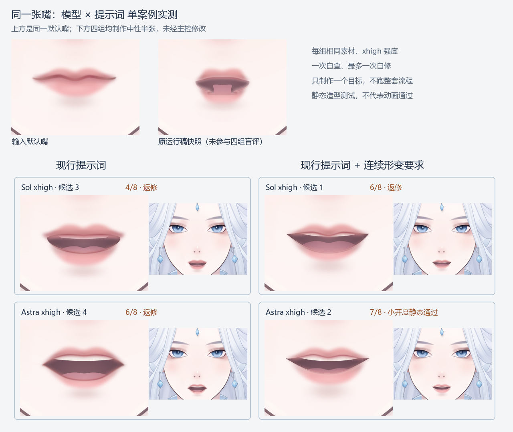

# 嘴部单案例：模型与提示词对照结果

## 结论

这次小样本中，换模型与增加具体连续形变约束都带来改善；没有证据把问题单独归给流程或模型，更无法确定一个“主要责任方”。

尤其需要更正之前的说法：**现行提示词已经写了上下唇、口角、嘴腔共同调整以及唇缘连续，不是完全没有要求连续性**；Sol 的现行提示词样本依然出现唇色罩着独立口洞，说明要求存在但没有执行到位。追加提示词把“如何从原嘴的具体结构建立对应”说得更明确，同模型样本的这项缺陷得到改善，但并未解决全部造型问题。

## 实際结果

同一完整 SVG 和三份既有图像参考，四个全新会话，均 xhigh；各组只制作中性半张目标，并统一渲染、匿名交另一会话评估。

| 模型 | 现行提示词 | 原文追加连续形变要求 |
|---|---|---|
| gpt-6-sol / xhigh | **4/8，返修**；唇体与口洞分离，原唇峰弱化 | **6/8，返修**；原嘴身份和连接改善，舌面拥挤、尖口角与微笑倾向仍在 |
| gpt-6-astra / xhigh | **6/8，返修**；连接成立，但开口偏大、菱形感和原嘴身份损失 | **7/8，仅小开度静态通过**；原嘴身份保留较好，仍有尖口角与整齐牙带 |

评分是一次匿名视觉评估，四项各0–2分：原嘴身份、唇体与开口连续、内部前后关系、正常面部观感；达到7分且身份/连续性没有0分才过本次静态门槛，分数不是客观美感测量。

[四组对照图](labeled_comparison.png) · [匿名原始对照](comparison/blind_comparison.png) · [完整盲评](comparison/blind_review.md)

## 能确定什么

- Sol + 现行提示词确实重现了用户指出的“外层唇色与内部几何口洞割裂”，并非只剩主观争论。
- 同为Sol，追加具体的原嘴结构对应要求后，从4分到6分，唇体连续性从0到2；提示词改动有可见价值。
- 同为现行提示词，Astra的样本从4分到6分，口角连接优于Sol，但形状仍硬，换模型没有自动产出好嘴型。
- 两项一起改变的样本最好，但仍不等于完美，也不代表后续动画能用。
- 四组嘴外 XML 都与输入完全一致，重复 ID 都为0，预览资源检查均通过；这些只证明局部修改边界，不计入造型得分。

## 不能确定什么

- 各组虽声明同一0.5参数值，但**没有共同的最大开口定义或明确的对应半张参考**：最佳样本的实际开口最小，Astra现行提示词样本最大，因此并非严格等开度的比较；不能把全部差异归因于模型或提示词。
- 每格只有一次生成，未排除随机性；匿名评估也只有一位模型评估者，最终审美仍应由用户看图判断。
- 这是新会话的单个静态目标，不能复现原长任务、多姿态、返修历史的全部影响。
- **没有制作插值或动画**，不能证明默认到半张全过程连续，也不能宣称完成动画验收。

因此，当前证据支持“执行能力与约束具体程度都有影响”，不足以支持“主要就是模型太弱”或“主要就是漏了一条提示词”的确定归因。

## 交付与复核

- [Sol／现行 SVG](a/character.svg) · [Sol／追加 SVG](b/character.svg)
- [Astra／现行 SVG](c/character.svg) · [Astra／追加 SVG](d/character.svg)
- [现行提示词快照](prompt_current.txt) · [追加版提示词](prompt_continuity.txt)
- [固定条件与局限](method.md) · [模型配置、时间与技术核对](runtime_evidence.json) · [盲评访问核对](blind_audit.json)

四组制作约2分06秒、3分01秒、4分52秒、5分25秒，均在六分钟上限内；保留生成脚本、原始参考、源文件快照和实际模型配置，生成脚本内路径仍指向测试临时目录，如搬迁重跑需调整路径。

正式工作流及原运行成果未修改，本次结果均单独保存；本报告不给四个样本追加返修，以保留对照结果。

方法参考：[OpenAI Evaluation best practices](https://developers.openai.com/api/docs/guides/evaluation-best-practices)，采用固定案例、具体标准和匿名成对判断；官方文档不为本报告的视觉分数背书。
