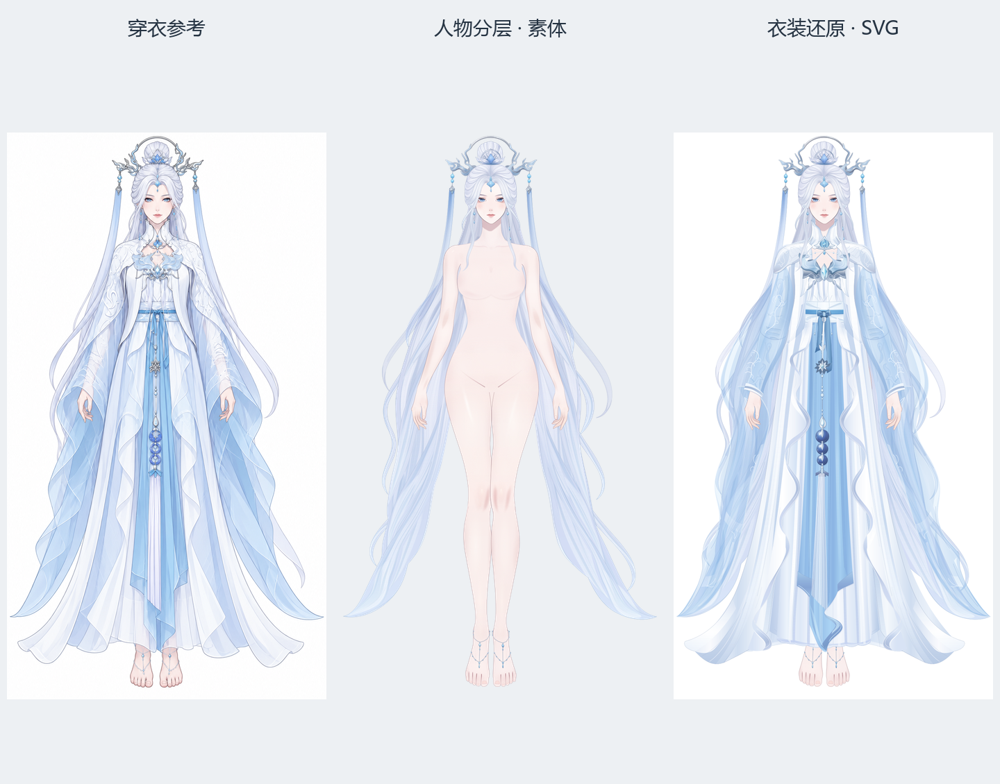

# Jianma：人物分层与衣装还原

2026-09-27 保存的实际交付快照：人物专项完成素体后，独立衣装流程在其上完成原衣还原；这里保存最终稿和参考；完整阶段稿、旧轮次、原运行脚本与审查证据分别保存在 [Jianma v4 实跑](../../outputs/jianma_v4/readme.md)和[衣装实跑](../../outputs/jianma_clothing/readme.md)。

## 文件

| 文件 | 用途 |
| --- | --- |
| [base.svg](base.svg) / [预览](base-preview.png) | 人物分层流程最后的素体整理结果，也是本轮衣装输入 |
| [outfit-reference.png](outfit-reference.png) | 用户本轮提供的穿衣参考 |
| [character.svg](character.svg) / [预览](preview.png) | 完整默认穿戴稿 |
| [clothing.svg](clothing.svg) | 独立分层衣装素材集合，按实际层位插入素体 |
| [clothing-index.json](clothing-index.json) | 穿搭层、实际部件、效果及显隐依赖 |
| [comparison.png](comparison.png) | 原运行导出的原图、成稿、叠合及代表性局部对照 |
| [snapshot.json](snapshot.json) | 本次快照各文件的原始相对位置及内容摘要 |

SVG 和原预览均原样复制；首页三栏图只排列已有图片，未改造型或重画。打开[预览器](../../loading/svg-preview.html)并拖入上述 SVG，即可查看分组和独显。

## 已有结构与后续限制

本轮人物专项已完成眼口内部件、分区头发、身体、手足及配饰；衣装具有真实内外层与背面补形，包含领口/袖口前后片、上下袖连接、三层裙摆和独立悬挂饰品。衣装索引的 50 个部件和 91 个效果均可定位到实际 SVG 节点；部件数量不等于动画控制器数量。

当前完成的是默认姿态的静态素材，后续需要实际绑定来检验转向、关节连接、裙摆和袖子摆动、透明接口以及投影跟随。已知纱袖长尾组 `gauze_sleeve_left_tail` / `gauze_sleeve_right_tail` 只含底形，部分纹样、边缘和高光位于兄弟节点；绑定时须让这些内容接受同一运动控制，并验证透明接口，不能只移动长尾底形。

衣装集合不能整张置顶；后披肩、背片和前片必须按索引穿插在身体、头发、手臂之间。当前素材有供后续动画使用的结构基础，尚未完成这套衣装的动态验收。

## 使用当前技能

制作同类素体使用 [`$live2d-layering`](../../.agents/skills/live2d-layering/readme.md)，衣装制作使用 [`$live2d-clothing`](../../.agents/skills/live2d-clothing/readme.md)；调用方法见[首页](../../readme.md#使用技能)。
