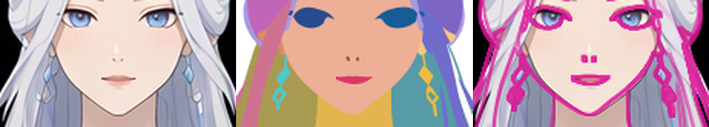

# 第 3 步独立审查

最终结论：**pass**。当前候选 SHA-256：`38bab0527ec626c10fbc531c5551a64b780a4955335870a5ef25b75859dce9e3`。

审查身份：`group_layers:review`。**R1、R2、R3 均已关闭，无剩余返修项。** 结论仅覆盖第 3 步纯色向量分组稿；未执行后续精修、着色、衣装或动画步骤。

输入：[当前 SVG](../../block-layers/character.svg)、[参考](../../references/base-subject.png)、[groups.json](../../structure/groups.json)。画布为 1024 × 1536；左右名称按角色自身方向。

## 问题关闭记录

| 首轮问题 | 最终结论 | 修复与复验 |
|---|---|---|
| R1 双肩透明楔缝 | pass | 躯干与上臂底形连续，肩部原缝已闭合；上一轮已独立通过，本轮相关像素保持一致。[肩部对照](../../block-layers/evidence/revision-r1-r3/shoulder-check.png) |
| R2 双耳遮挡及发组隐藏底形 | pass | 外耳廓和窄耳垂露出正确。中间版本的固定耳形裁切已删除；头顶发块、双侧刘海独显均恢复完整底形，无封闭穿孔。双耳采用完整底形与前置耳廓分段叠放，按同一叶路径聚合显隐，两段一起消失。[完整发组](../../block-layers/evidence/revision-r2-bases/complete-hair-bases.png)、[双耳聚合显隐](../../block-layers/evidence/revision-r2-bases/ear-leaf-aggregation.png) |
| R3 耳坠上段剪影 | pass | 细连接颈、菱坠和下环关系恢复，连接处无 evenodd 相消裂口；上一轮已独立通过，本轮相关像素保持一致。[耳坠对照](../../block-layers/evidence/revision-r1-r3/earring-check.png) |

## 验证范围与版本

首轮 `e2cbc656…` 已审查整图、六大类和全部 45 叶路径，发现 R1–R3。中间版 `a8720cca…` 已通过 R1、R3 和可见耳部，剩余发组穿孔在本轮关闭。临时连体服排除、身体遮挡补全和其余未改内容沿用此前通过结论；旧叶组页仅作对应未改内容的历史证据。

本轮使用绑定 `svg_preview.py` 独立重渲染，并用绑定 `compare.py` 核对局部外观。确认 45 个逻辑叶路径与清单完全一致、47 个绘制段 ID 全部唯一，无 clipPath 或 mask；双耳各两个绘制段共享所属完整路径。7 个相关叶路径均按全部 ID 聚合独显／隐藏：7/7 独显非空，7/7 隐藏后实际改变整图，双耳无前置段残留。头顶发块和双侧刘海的 4 倍直接渲染均无封闭孔洞，目视完整底形及耳区叠放通过。

独立当前渲染与作者当前渲染 RGBA 像素一致；相对上一版仅 66 个像素变化，全部位于耳区 `x=446–587, y=272–282`，R1/R3 对应区域完全不变。[最终检查记录](evidence/recheck-final/checks.json)、[复验脚本](recheck_final.py)。本轮只检查剩余 R2 与必要邻接，没有重读全部历史图片或扩展到后续步骤。

## 全部叶路径最终状态

| group 路径 | 最终结论 | 说明与证据 |
|---|---|---|
| `face/face_base` | pass | 脸颊、下颌和下巴轮廓一致，额头在发后有底形。[页06](../../block-layers/evidence/leaf-sheets/06.png) |
| `face/eyes/left_eye` | pass | 位置、宽度和眼角轮廓符合纯色色块标准。[页08](../../block-layers/evidence/leaf-sheets/08.png) |
| `face/eyes/right_eye` | pass | 位置、宽度和眼角轮廓符合纯色色块标准。[页08](../../block-layers/evidence/leaf-sheets/08.png) |
| `face/left_eyebrow` | pass | 眉位、倾向和主要长度通过。[页08](../../block-layers/evidence/leaf-sheets/08.png) |
| `face/right_eyebrow` | pass | 眉位、倾向和主要长度通过。[页08](../../block-layers/evidence/leaf-sheets/08.png) |
| `face/nose` | pass | 鼻部标记位置正确，没有要求光影细化。[页08](../../block-layers/evidence/leaf-sheets/08.png) |
| `face/mouth` | pass | 口部宽度、位置及主要外形通过。[页09](../../block-layers/evidence/leaf-sheets/09.png) |
| `face/left_ear` | pass | R2 已关闭：完整底形与前置耳廓按同一路径聚合显隐，无残留绘制段。[当前聚合对照](../../block-layers/evidence/revision-r2-bases/ear-leaf-aggregation.png) |
| `face/right_ear` | pass | R2 已关闭：完整底形与前置耳廓按同一路径聚合显隐，无残留绘制段。[当前聚合对照](../../block-layers/evidence/revision-r2-bases/ear-leaf-aggregation.png) |
| `hair/crown_hair` | pass | R2 已关闭：独显底形完整，双侧耳形孔洞消失。[当前完整发组](../../block-layers/evidence/revision-r2-bases/complete-hair-bases.png) |
| `hair/top_bun` | pass | 圆髻位置正确，冠饰后底形完整。[页01](../../block-layers/evidence/leaf-sheets/01.png) |
| `hair/left_bangs` | pass | R2 已关闭：固定裁切和耳形边缘缺口已删除，底形连续。[当前完整发组](../../block-layers/evidence/revision-r2-bases/complete-hair-bases.png) |
| `hair/right_bangs` | pass | R2 已关闭：固定裁切已删除，独显无封闭三角孔。[当前完整发组](../../block-layers/evidence/revision-r2-bases/complete-hair-bases.png) |
| `hair/left_side_lock` | pass | 本轮相邻遮挡复验通过；耳廓、耳垂和主发束关系保持。[当前局部对照](evidence/recheck-final/ears/comparison.png) |
| `hair/right_side_lock` | pass | 本轮相邻遮挡复验通过；耳廓、耳垂和主发束关系保持。[当前局部对照](evidence/recheck-final/ears/comparison.png) |
| `hair/left_back_hair` | pass | 身后底形连续，肩侧可见范围和发尾通过。[页01](../../block-layers/evidence/leaf-sheets/01.png) |
| `hair/right_back_hair` | pass | 身后底形连续，肩侧可见范围和发尾通过。[页01](../../block-layers/evidence/leaf-sheets/01.png) |
| `body/neck` | pass | 颈部至锁骨底形连续，受脸部遮挡处有延伸。[页05](../../block-layers/evidence/leaf-sheets/05.png) |
| `body/torso` | pass | R1 已修：双肩底形连续。[当前肩部对照](../../block-layers/evidence/revision-r1-r3/shoulder-check.png) |
| `body/arms/left_arm/left_upper_arm` | pass | R1 已修：与躯干重叠衔接，独显完整。[当前底形](evidence/recheck-r1-r3/complete-bases.png) |
| `body/arms/left_arm/left_forearm` | pass | 肘至腕外轮廓、位置及相邻组重叠通过。[页05](../../block-layers/evidence/leaf-sheets/05.png) |
| `body/arms/left_arm/left_hand` | pass | 手指轮廓、拇指开口和腕部连接通过。[页05](../../block-layers/evidence/leaf-sheets/05.png) |
| `body/arms/right_arm/right_upper_arm` | pass | R1 已修：与躯干重叠衔接，独显完整。[当前底形](evidence/recheck-r1-r3/complete-bases.png) |
| `body/arms/right_arm/right_forearm` | pass | 肘至腕外轮廓、位置及相邻组重叠通过。[页05](../../block-layers/evidence/leaf-sheets/05.png) |
| `body/arms/right_arm/right_hand` | pass | 手指轮廓、拇指开口和腕部连接通过。[页05](../../block-layers/evidence/leaf-sheets/05.png) |
| `body/lower_body/pelvis` | pass | 衣下骨盆和髋部底形连续，未保留高开腿衣边。[页04](../../block-layers/evidence/leaf-sheets/04.png) |
| `body/lower_body/left_leg/left_thigh` | pass | 上端在骨盆后补全，腿部外轮廓和膝部连接通过。[页03](../../block-layers/evidence/leaf-sheets/03.png) |
| `body/lower_body/left_leg/left_calf` | pass | 小腿比例、外轮廓和踝部延伸通过。[页03](../../block-layers/evidence/leaf-sheets/03.png) |
| `body/lower_body/left_leg/left_foot` | pass | 脚背和脚趾外轮廓通过，饰带下为完整足部。[页04](../../block-layers/evidence/leaf-sheets/04.png) |
| `body/lower_body/right_leg/right_thigh` | pass | 上端在骨盆后补全，腿部外轮廓和膝部连接通过。[页03](../../block-layers/evidence/leaf-sheets/03.png) |
| `body/lower_body/right_leg/right_calf` | pass | 小腿比例、外轮廓和踝部延伸通过。[页03](../../block-layers/evidence/leaf-sheets/03.png) |
| `body/lower_body/right_leg/right_foot` | pass | 脚背和脚趾外轮廓通过，饰带下为完整足部。[页03](../../block-layers/evidence/leaf-sheets/03.png) |
| `headdress/rear_arch` | pass | 弧架连续，中央大开口透明，端部连接通过。[页01](../../block-layers/evidence/leaf-sheets/01.png) |
| `headdress/lotus_crest` | pass | 冠饰总体外轮廓和与发髻的遮挡通过。[页09](../../block-layers/evidence/leaf-sheets/09.png) |
| `headdress/forehead_ornament` | pass | 额饰垂线、顶部小孔和菱形位置通过。[页09](../../block-layers/evidence/leaf-sheets/09.png) |
| `headdress/left_branch/left_branch_base` | pass | 外侧卷曲、分叉和内部开口保留。[页02](../../block-layers/evidence/leaf-sheets/02.png) |
| `headdress/left_branch/left_hanging_streamer` | pass | 悬挂点、珠串和长条弧度及末端通过。[页02](../../block-layers/evidence/leaf-sheets/02.png) |
| `headdress/right_branch/right_branch_base` | pass | 外侧卷曲、分叉和内部开口保留。[页01](../../block-layers/evidence/leaf-sheets/01.png) |
| `headdress/right_branch/right_hanging_streamer` | pass | 悬挂点、珠串和长条弧度及末端通过。[页02](../../block-layers/evidence/leaf-sheets/02.png) |
| `earrings/left_earring` | pass | R3 已修：细颈、菱坠和下环轮廓恢复，重叠处无相消裂口。[当前对照](../../block-layers/evidence/revision-r1-r3/earring-check.png) |
| `earrings/right_earring` | pass | R3 已修：细颈、菱坠和下环轮廓恢复，重叠处无相消裂口。[当前对照](../../block-layers/evidence/revision-r1-r3/earring-check.png) |
| `sandals/left_sandal/left_jeweled_strap` | pass | 珠链围绕脚踝并连接到脚趾，脚背开口保留。[页09](../../block-layers/evidence/leaf-sheets/09.png) |
| `sandals/left_sandal/left_sole` | pass | 可见薄底轮廓与脚下遮挡通过。[页02](../../block-layers/evidence/leaf-sheets/02.png) |
| `sandals/right_sandal/right_jeweled_strap` | pass | 珠链围绕脚踝并连接到脚趾，脚背开口保留。[页09](../../block-layers/evidence/leaf-sheets/09.png) |
| `sandals/right_sandal/right_sole` | pass | 可见薄底轮廓与脚下遮挡通过。[页02](../../block-layers/evidence/leaf-sheets/02.png) |

本次仅更新审查报告及复验证据，未修改 SVG、参考、groups 或运行记录。
