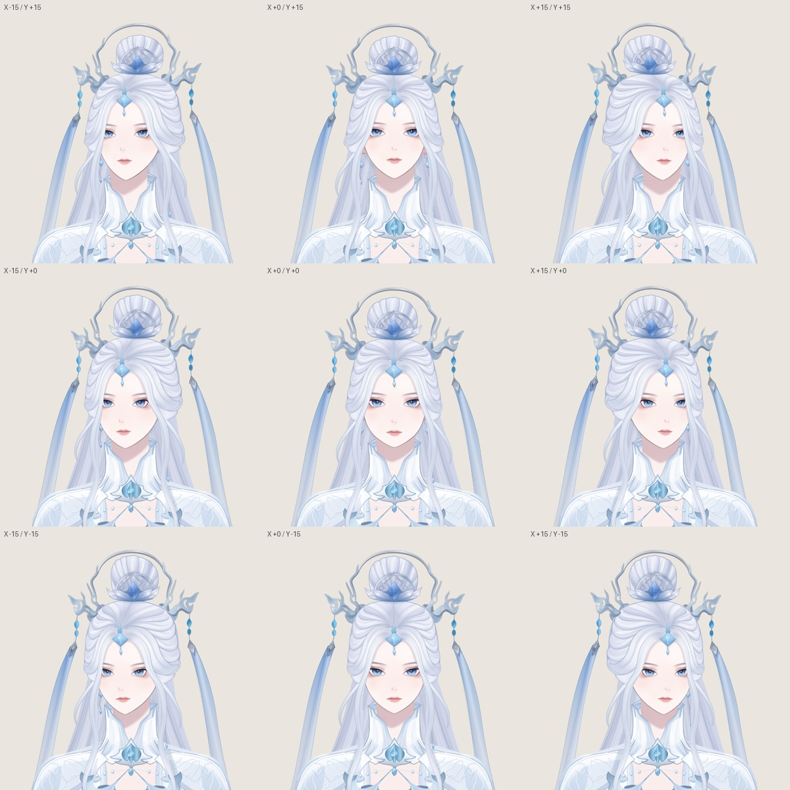
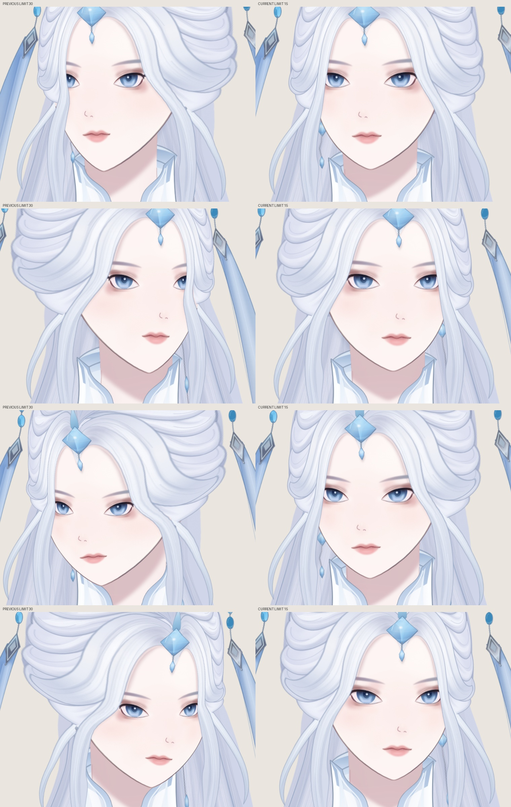

# 剑妈：头脸修型与头部九宫格

2026-10-08 用户明确授权修改原 SVG 头型与五官，依据此前生成九轴参考进行美术修订。当前原稿为 `artwork/character.svg`，与游戏工作台的基础表情使用相同字节；历史原稿、提交和 SHA-256 记录在 `source.json.base`。

- 收紧上部发团，在耳旁恢复原发束宽度，保持前后发的连续轮廓。缩短隐藏上颅轮廓，使其不再上宽下窄地突变。
- 重画头脸填充、可见下颌轮廓及其所有接收面/投影副本，给下巴适量宽度并缩短约 5px。
- 眼睛略微打开，眉形减薄，嘴唇略微收窄；用轻鼻翼线代替两个深色圆点，减轻鼻尖高光和腮红。
- 眼口眉的局部路径与关键形不改，作者调整位于各区域父组，因此睫毛/眼皮/虹膜/遮罩和整套极值一起跟随。嘴巴开合的纵向范围保留。
- 保留颅底颈柱挂接与显示缓存；当前使用 v9 的平滑脸缘、局部五官平面与明确遮挡层次。



## v9：脸缘与局部五官分开控制

v8 虽然通过网格无翻折检查，脸缘仍会在三角控制区边界形成颊部凸起；五官周围的局部控制点也挤压了整张脸。v9 按真实渲染结果重画各方向的颊部到下巴曲线。

- `keyforms.face.contours` 的 `source` 保存原脸缘两侧的分段三次曲线，`poses` 保存八个边界姿态的作者曲线。编译器沿源曲线的弧长生成约束，平滑插值脸底、脸部颜色和下巴投影。曲线控制柄就是可编辑真源。
- `keyforms.face.landmarks/poses` 保留脸型与五官挂点。`featureForms` 只规定各方向的局部横纵轴；中心始终从脸上取。眉毛复用同侧眼睛的局部平面，眼周控制区不会再折弯整个下颌。
- `occlusion` 区分侧发体积和额前长发。侧发、耳坠在脸后，额前长发在脸和耳坠之前；按变形后的真实轮廓覆盖。不在 X=0 切换绘制顺序，不截断半条发束，不把耳朵淡出或给耳坠挖脸形缺口。
- 头顶、发髻、前后发根及物理继续沿用逐部件关键形；GPU 只插值预先编译的九个形态。原 SVG、纹理缓存、12 个基础表情参数保持。

本轮退回了两份试稿：直接对密集眼周控制点作平滑拟合仍产生凹凸；按高度截断远侧发束造成直线切口。最终使用独立脸缘曲线和完整部件遮挡。几何和截图分别验收。

## 小幅朝向：X / Y 的实时边界为 ±15

用户提供的小幅转头示例以方向感为目标，不要求达到刚性三维旋转的 30°。X / Y 的滑杆、方向面板、九宫格、巡览与游戏工作台鼠标跟随统一读取 `parameters`，当前为 ±15；Z 保留独立 ±20。显示范围与物理输入均受同一边界约束。

`keyformExtent` 保留原作者插值域 ±30。因此当前 15 对应此前 15 的原有形状，没有把旧 30 极值改名为 15。低层作者采样仍能检查完整旧域，避免收窄显示范围后丢失历史几何验证。原 30 边界只用于作者记录，不在实时页面展示。



实际检查了 ±15 九个边界、±7.5 中间姿态、裸脸与颈部衔接；`nine-poses.jpg` 是当前范围。此前的大幅度参考对照与失败记录保持作为历史过程。

## 投影与衔接

- 头发与额饰的原始投影路径从脸部缓存中分离，跟随投影来源的同一变形与惯性；接收面的裁剪交给实时变形后的脸/耳朵网格。
- 原下巴投影先还原来源坐标，再变形并加回原画的光照偏移，最后裁剪在实时脖子网格内。不能把阴影像素的纵坐标误当成脸上对应点。衣领只小幅跟随颅底，缝合边固定。
- `tools/prepare-artwork.mjs` 只操作显示克隆。保留原始投影几何、颜色、模糊和局部分区；撤掉烘焙的接收面裁剪，并记录到 `layers.json`。显示准备不再二次修改修型稿。
- 嘴部重复肤色填充仍用原路径作为口腔遮罩；唇线、开口、局部颜色和阴影保留，肤色底面由脸层提供。
- 48 张可重建 PNG 只作预览缓存；透明纹理采样前预乘 Alpha。鼠标移动不重新栅格化 SVG。

## 参考与实测

参考用户的头部九轴视频，以及 [psd2live 3.0](https://github.com/tsunehimatoi/psd2live/tree/4002ac28c084112f3f0103b2575aa9841693d856) 的 `NinePoseFaceRig.kt`、`RigBuilder.kt` 层级与局部修正设计。实际运行了官方 3.0.0 Linux 包，先输入仓库 TML PSD，再输入由同一剑妈原 SVG 导出的 39 层 PSD；纯 X/Y 各采样九个位置，关闭 Z/物理，对照默认配置与开启 `featureDisplacementEnabled` 的配置。

实测说明：上游可以产生弧形纬线与局部五官变化，但直接输入这份长发、长配饰原稿仍有挂接和遮挡问题，不能把上游默认生成结果直接当成剑妈成品。本例按同一层级原则独立实现，没有移植上游代码、示例美术或将其输出冒充本例效果。

此前还实际加载了官方 [Haru](https://www.live2d.com/en/learn/sample/haru/)、[Hiyori](https://www.live2d.com/en/learn/sample/momose-hiyori/)、[Mark](https://www.live2d.com/en/learn/sample/mark/)；它们用于观察整体/局部变形与遮挡关系，不包含在发布资产中。

## 重建与检查

```sh
git show 0049060aa29c684dda998d883a06947d4736cae1:outputs/jianma_clothing/final/character.svg > /tmp/jianma-source.svg
python3 rigging/jianma2d-head/tools/refine-portrait.py /tmp/jianma-source.svg /tmp/jianma-refined.svg
# /tmp/jianma-refined.svg must match artwork/character.svg byte for byte.
node rigging/jianma2d-head/tools/build-atlas.mjs rigging/jianma2d-head/artwork/character.svg
node --test rigging/jianma2d-head/deformer.test.mjs rigging/jianma2d-head/physics.test.mjs
```

缓存重建需要 Playwright/Chromium 与 Python Pillow，可通过 `ASTRA_PLAYWRIGHT`、`ASTRA_CHROMIUM` 指定工具路径。源哈希不符时拒绝执行。

28 项几何、来源、遮挡所有权与惯性检查通过，保留全部实际显示网格无翻折断言。脸部平面与曲线的检查替代旧的三角控制区逐点同变形断言；没有降低网格翻折阈值。正面及低头时，X=±0.000001 与 X=0 的实际截图逐像素相同。实际检查了正脸、裸脸、九个边界及中间姿态。工作台同时提供生成参考、当前九宫格和同构图修型前后对照。美术参考仍有侧鼻、配饰和衣领差异；不宣称完全复刻。没有重新测量 Mac/Safari 帧率。

基础表情与头部仍为独立预览。状态不写入存档、不导出、不同步。
