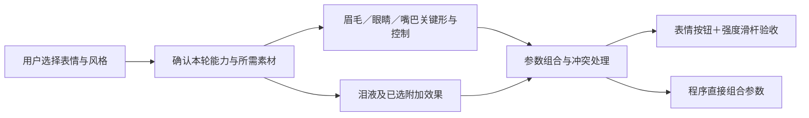

# 表情工艺：用户按表情验收，程序按参数组合

2026-09-27 · 调研与讨论稿，尚未编排执行节点或运行表情制作。

**按最新视频与两阶段要求更新**：以 [视频清单、两阶段 SOP 与控制协议](expressions/README.md) 为当前实施提案；已补 schema 和可校验的协议样例，人物运行时尚未实现。下文保留眉眼嘴的方法论，第 8 节已改为先补素材/关键形、再生成控制 JSON。

新工作流在本目录继续设计；后续分析、制作和联调任务统一先用 **gpt-6-sol / xhigh**，通过第一轮实际形变表现判断是否够用。已发布的两个分层技能及其模型配置保持原状态。

## 1. 建议确定的方向

**先制作可以连续调节的眉眼嘴，再把这些控制组合为可验收的表情预设。** 用户勾选“哭泣、微笑、汗颜、吐舌”等需求，程序获得这些预设所使用的独立参数、素材及兼容规则；预设之外仍能重新组合。

哭泣和视频中的基础贴图能力进入制作提案，具体范围见视频清单；初始画面仍保持角色的原始默认状态，特殊款式一次确认。用户要求的“表情枚举”用于描述要交付什么，不把所有能力压成一个只能互斥切换的 `expression` 数字。

以下为基于教程和当前 SVG 的设计建议，参数数量、形变幅度及效果风格仍需通过角色实际制作确定。

## 2. 教程给出的具体制作要求

### 眉毛：位移、角度、弯曲分别控制

本地教程第 5 讲区分每侧眉毛的上下、左右、角度、变形，制作顺序是先处理眉形，再处理转角，最后处理整体位移；眉毛周围不能带着一圈皮肤一起移动。

落实到 SVG：

- 左右眉分别识别真实控制组、眉头眉尾和弧线，不用旧角色坐标套新角色。
- 上下/内外移动、旋转和弯曲各有清楚的作用范围；同方向数值表达相同语义，左右坐标镜像由绑定转换。
- 基础眉形覆盖中性、内侧抬起的委屈趋势、内侧压低的生气趋势，再按原画风微调；复杂曲线用少量关键形，避免直接压扁整条眉。
- 颜色与自然柔边随眉形一起变形；刘海遮挡沿用当前设计，不能新增发上散点。

### 眼睛：先开闭，再笑眼，再视线

第 3 讲的三类部件仍然适用：轮廓部件（上下眼睑、眼白）、眼内部件（虹膜、瞳孔、高光）、装饰部件（睫毛、眼皮等）。

- 开闭首先改变上下眼睑及眼白开口，再让睫毛、眼皮和必要眼周层次跟随；闭眼由动态开口裁切眼内，不能把虹膜压成扁条来假装闭眼。
- 笑眼与开闭是两个维度：普通闭眼和笑眯眼需要不同轮廓；半闭眼也要能自然过渡。
- 视线 X/Y 带动眼内部件，四个斜向位置也要确认不会露出空洞、越界或丢失高光；对应承影裁切随几何更新。
- 虹膜多层颜色和亮带继续保留在原部件中；形变阶段不改成单色圆球。
- 即使静态双眼是镜像制作，运行时仍需能左右独立开闭，才能支持眨单眼和不对称表情。

第一轮先做中性、半闭、闭合的开闭依据，再建立笑眼形；只有中间态仍有明显问题时才补关键形，不默认将每只眼扩展为大量格子。

### 嘴巴：开合与悲喜嘴型必须交叉制作

第 4 讲用嘴开闭与嘴变形两个主维度，基础示例是 **3 种嘴型 × 2 个开合状态**；关键点多寡取决于实际表现，不能只保证完全张开和完全闭合两张图。

- 嘴上、嘴下、嘴内、上牙、下牙、舌头保持完整；先调轮廓，再调内件和唇色。
- 嘴角保持连续圆顺，闭合接触线自然；张开时上/下嘴周遮盖、内腔和牙舌共同接续。
- 唇色、唇部高光、局部皮肤层次和必要承影都要跟随，不能只动一条黑线。
- 采用 3×2 作为首轮起点，实际查看半开状态；必要时扩展到 3×3，不能为了省关键形接受中间态的破口或硬边。
- 明显张口时考虑少量下巴与嘴周联动；变化范围根据实际角色确定。
- 嘴宽窄、左右歪嘴、吐舌、元音口型都是追加能力，不能把每一项默认变成本轮必做。

这意味着第一轮主要工作是“制作关键形、绑定几何和材质、保证插值”，不是重新执行整套线稿和着色流程。

## 3. 对现有素材的实际判断

检查来源：[Jianma 当前素体](../demos/jianma-current-case/base.svg)、[Milly v3 参数与实现](../rigging/milly/v3/rig.js)。

| 现有内容 | 能继续利用什么 | 表情阶段仍须完成什么 |
| --- | --- | --- |
| `brow_left/right` | 两侧眉毛已独立 | 每侧控制坐标、弧度关键形、组合范围 |
| `eye_left/right`、眼口裁切、gaze/iris/highlights 等 | 眼部内部结构和材质已分开 | 动态开口、闭合/笑眼关键形、独立视线及效果跟随 |
| `eye_left` 含水平镜像变换 | 可以复用静态几何制作经验 | 把屏幕坐标转换到本侧局部坐标，确认 L/R 语义；不能将运行控制也锁成同步 |
| 嘴上/下、嘴内、上下牙、舌头六个独立组 | 已有隐藏嘴内部件，舌头目前受口内裁切 | 开合×嘴型关键形、口内可见关系、唇色与嘴周层次联动 |
| 素体没有 tear/sweat 命名的节点 | 当前没有可直接确认复用的泪汗层 | 首轮哭泣需要识别并补充实际素材；其他角色须先核对自己的既有实体 |
| Milly v3 已有眉眼嘴参数、滑杆和几个预设 | 可借鉴参数调节、预览与基本控制思路 | 旧实现坐标与嘴型公式绑定 Milly，不能原样套给 Jianma |

Milly 当前预设使用完整默认值展开，选择预设会同时重设其他控制；自动眨眼还会直接重写左右开合。新实现要保留未涉及的控制，并明确表达式、眨眼、视线和说话的合成顺序，避免“选了悲伤就重置视线”或“单眼闭合被自动眨眼重新打开”。

以上是结构与代码检查，不表示当前 Jianma 已经通过表情形变测试。

## 4. 用户输入的枚举颗粒度

### 4.1 用户确认三件事即可

1. **需要哪些表现**：基础表情与视频贴图清单，加上任意自定义需求；用户用名称＋外观描述或参考图说明即可，汗颜、吐舌只是示例，不是追加项的上限。
2. **表现到什么程度**：克制自然 / 常规动画 / 夸张漫画；同名表情的幅度和新增图形样式据此确定。
3. **追加效果的具体形式与保留动作**：对真正增加素材或改变结构的项目，确认样式及是否仍需眨眼、说话、流泪等行为；选项用于帮助说明，也接受未列出的形式。

不要求用户先填几十个控制参数，也不让其枚举全部组合；第一次分析把基础清单、具体样式及不适用项整理为简短需求表，在绘制前确认一次。已有参考能确定的造型直接列为拟采用项，视频清单之外的自定义项按用户需求追加。

### 4.2 建议的基础验收清单

| 枚举项 | 要验收的视觉结果 | 主要复用控制 |
| --- | --- | --- |
| 中性 `neutral` | 返回输入角色默认面容，关闭新增情绪效果 | 各控制默认值 |
| 微笑 `smile` | 嘴角上扬、可轻度笑眼，仍能眨眼和张口 | 嘴型、笑眼、眉毛 |
| 开心闭眼笑 `laugh` | 闭合笑眼与开心嘴型，可选择开口强度 | 眼开闭×笑眼、嘴开合×嘴型 |
| 悲伤/委屈 `sad` | 眉头与眼口共同表达悲伤 | 眉形、眉角、眼型、嘴型 |
| 生气 `angry` | 压眉与紧张眼口；漫画怒标另外选择 | 眉角、内收、眼开度、嘴型 |
| 惊讶 `surprised` | 提眉、开眼、张嘴，保持角色特征 | 眉高、眼开度、嘴开合；必要时加嘴宽 |
| 困倦/无奈 `sleepy` | 半闭眼与相应眉口，保留自然眨眼 | 眼开度、眉高、嘴型 |
| 单眼眨眼 `wink_left/right` | 一侧独立闭合，另一侧保持当前状态 | 单侧开闭、可选单侧笑眼 |
| 哭泣 `cry` | 悲伤眉眼嘴＋泪液，能调轻重 | 悲伤相关控制＋泪液控制 |

这是建议基础清单；**哭泣根据你的要求列为默认必做能力**，其余基础表情作为待确认的推荐集合。不同角色如缺少常规眉眼嘴，分析阶段说明对应替代机制，不能机械添加不符合角色设计的器官。

### 4.3 哭泣的细分

| 制作选择 | 内容 | 建议 |
| --- | --- | --- |
| 含泪 | 眼眶积泪，随下眼缘变化 | 哭泣基础能力的一部分 |
| 泪滴/泪流 | 眼眶积泪＋向脸颊流动的泪滴，可循环 | 推荐的首轮哭泣交付 |
| 漫画面条泪 | 连续条状泪及显示范围蒙版 | 纳入视频基础清单，样式与泪滴型分别保留控制 |

眼眶泪和流动泪分开：前者跟眼缘，后者有沿脸部下落的轨迹及出现/消失范围；流动速度/循环相位属于动画驱动，不能用一个透明度滑杆冒充流泪动画。

已有泪液仍属于 eyes 的内部组件，优先复用并增加控制；新增泪液同样沿用眼部归属，不恢复一个与 eyes/face 重复制作的全局 `expressions` 分类。泪液高光跟随泪体，不能错误地跟随虹膜视线或被眼白裁切截断；脸颊泪的显示范围按脸部及实际遮挡处理。

“悲伤”和“眼泪”分别控制，因此可以得到含泪微笑、开心落泪，不能让 `tear_amount` 自动强制悲伤嘴型。

### 4.4 特殊表情是开放需求，按制作机制落实

第 11 讲没有给出封闭的表情目录，而是允许任意贴图与特殊五官；它要求逐项判断：**贴图自身是否运动、跟随哪个部位、是否替换原有部件**。本流程也不预先枚举所有表情，只为本轮实际需求制作素材与控制；用户以后追加新的表现时，复用已有能力，并补足新增的素材、绑定和必要兼容关系。

下列机制是分析工具，同一个表情可以同时使用多种：

| 制作机制 | 教程示例与实际处理 | 需要确认的边界 |
| --- | --- | --- |
| 既有部件形变与材质调节 | 眉眼嘴形变、高光减弱或关闭、原有红晕显隐 | 能否由已有控制表达，需要补哪些关键形 |
| 叠加贴图及自身运动 | 星星/爱心、脸红、额头阴影、黑线、汗珠、怒标、问号 | 跟随对象、遮挡/裁切、显隐强度；是否另有跳动或流动循环 |
| 局部贴图变体 | 多套眼内高光、换色或发光的眼黑贴图 | 替换的是虹膜/瞳孔、某套高光还是其他局部；保留原有眼睑与开闭控制 |
| 整体五官替换 | 圈圈眼、难以由原嘴形变得到的特殊嘴型 | 替换后是否仍需眨眼、开口说话及适配泪液；只承诺已制作的行为 |

**眼内效果不能全部合并成一个互斥的“特殊眼睛”选项。** 高光显隐/变体、眼黑变体、叠加图案、完整眼型分别判断：星星和爱心按教程放在眼睑下、以眼白为裁切依据；更换眼黑可以继续使用原眼睑，普通闭眼仍能遮住它；整个眼型替换才可能改变这些关系。图案是叠加还是代替原瞳孔/高光，由本轮外观要求决定；只对占用同一替换位置的变体规定互斥，不禁止无冲突的效果组合。

“汗颜”也只是需求名称，可以是自然汗珠、大汗滴加黑线，或用户提供的另一种设计；先确认实际外观，流汗才补充运动轨迹和上下渐隐的范围蒙版。脸部红晕与额头着色跟随脸，怒标等可在跟随头部之外独立跳动；多个图形只有需要独立控制时才分别处理。

汗珠、脸部着色与附着符号沿用 face 的局部归属，眼内图案归 eyes；浮动符号记录自己的头部锚点与身份，不增加分层工作流的基础 kind。分析结果在每项需求下简记“复用/新增什么、跟随什么、自身怎么动、替换什么、保留哪些行为”即可，不另外建立穷尽所有表情的分类体系。

替换五官会扩大组合适配成本：教程明确指出，普通眼的面条泪换到新眼型上需要重新调整；新嘴型可选择静态替换，也可补齐拆分与开合控制，后者工作量更高。只核对用户实际要求的组合，不宣称任意新增贴图都能自动适配全部五官变体。

教程还给出低成本方案：将 PNG 作为面捕软件中的挂件，适合无需模型内部穿插的符号或对话框；它通常不能改变角度，也不能承担眼内裁切或嘴唇前后遮挡。此类外部挂件按使用平台另选，不作为当前 SVG 运行时的默认依赖。

### 4.5 吐舌与口部扩展

吐舌是上述开放需求的一个例子，不设穷尽舌头姿态的固定菜单：先确认外观及是否需要连续伸出、偏向或卷曲，再确定需要补哪些形态。连续吐舌使用独立舌头与伸出控制；只需一种夸张漫画嘴时，也可选择专用嘴型替换，并明确它是静态展示还是仍需开合说话。

- 通过用户是否需要俏皮/挑衅类表现决定是否制作；程序、快捷键和预设都能触发，不以当前是否接入面捕硬件作为唯一判断。
- 已有口内舌头不等于能吐舌：伸出口外需要完整舌形、嘴唇前后层位、根部遮挡和新的可见范围，不能把整条舌头永久锁在口内 clip 中。
- 伸出量与嘴开合、嘴型分开，但需要共同校准；吐舌所需的最小嘴缝由实制结果确定并写入约束，不凭空套固定阈值。
- 若直接控制器提交“闭嘴＋伸舌”这种冲突请求，预览明确展示实际约束结果；预设可同时给出合适嘴开度，不能通过隐藏改值让调用者无从知晓。
- 语音输入先区分【本轮不接 / 预留开口输入 / 精细口型后续专题】；完整音素口型与音频识别不是本轮表情工艺的默认依赖。

## 5. 内部参数建议

为便于将来适配，基础控制语义尽量对齐 Live2D 的眉毛四维、双眼开闭/笑眼、视线及嘴开合/嘴型；标准表为常规开闭定义了 0～1 的区间，也允许按需要扩展，但扩展区间必须先制作对应形态。[官方标准参数表](https://docs.live2d.com/en/cubism-editor-manual/standard-parameter-list/)

下表是本项目的规范化接口草案，不代表当前 SVG 已具备这些绑定；左右统一使用**角色自身左右**，读取源 SVG 时显式映射。

| 通道 | 拟定范围与默认 | 说明 |
| --- | --- | --- |
| `brow.{L,R}.height/inward/angle/curve` | -1～1；0 为原状态 | 各侧独立，控制高低、内外、倾斜和弧度 |
| `eye.{L,R}.open` | 0～1；默认 1 | 0 为闭合，1 为本角色默认开度；更大惊讶开眼需另建扩展关键形 |
| `eye.{L,R}.smile` | 0～1；默认 0 | 与开闭组合，形成普通/微笑闭眼及中间态 |
| `gaze.x/y` | -1～1；默认 0 | 双眼协调看向同一方向，各眼局部位移分别标定 |
| `mouth.open` | 0～1；按输入确定默认 | 运行默认值与源画面一致，不强制把原本张嘴的人物变为闭嘴 |
| `mouth.form` | -1～1；0 为中性 | 从下压嘴角到上扬嘴角，分别配合开合 |
| `mouth.width/asymmetry` | 按需开放 | 只有需求或已选预设确实需要才制作 |
| `tongue.out` | 0～1；默认 0 | 选择吐舌时提供；扩展动作另加具体通道 |
| `tear.{L,R}.amount` | 0～1；新增泪默认 0 | 双侧可分别控制，不强制同时显现 |
| `tear.flow_speed` | 非负；按样式设定 | 由时间驱动生成循环相位；相位不当成情绪强度 |
| `blush.amount / sweat.amount / gloom.amount` | 0～1；按现有素材确定默认 | 各自控制，原本就有的妆色/红晕不应被默认清除 |
| `symbol.<已选种类>.amount` | 0～1；新增符号默认 0 | 独立附加效果可与基础表情组合 |
| `eye.{L,R}.iris_variant / highlight_variant` | 按已制作变体列举；默认原素材 | 眼黑与高光分别选择，不强制一起更换；高光显隐另有独立强度 |
| `eye.{L,R}.shape_variant / mouth.shape_variant` | 按已制作替换件列举；默认原五官 | 完整五官替换，逐项声明支持的开闭、视线、说话及附加效果 |
| `tear.style` | 按已制作泪液样式列举 | 样式选择与泪量分开，明确适用的眼型 |

参数范围描述的是已制作的控制区间，不是全角色通用的像素位移或角度。若源表情不在语义中性位置，保留其默认参数状态并注明映射。表中仅为起点，新需求按实际新增控制；无需求的变体通道不必全部生成，离散变体不直接作类别数值插值，切换时的淡入淡出另行处理。

## 6. 组合机制：预设只修改自己负责的通道

预设是稀疏参数配方，附带使用的通道、强度、过渡时间与必要约束；不使用 `...全部默认值` 在每次切换时覆盖全脸和全身。

| 组合例子 | 配方概念 | 不能顺带覆盖的内容 |
| --- | --- | --- |
| 哭泣 | 悲伤眉眼嘴＋泪液 | 当前视线、头身姿态 |
| 含泪微笑 | 微笑嘴型＋柔和眼型＋积泪 | 不强制叠加悲伤嘴型 |
| 汗颜 | 用户选定的无奈眉眼嘴＋汗珠，可能再带黑线 | 无关泪液/瞳形/头部方向 |
| 生气流泪 | 生气基础配方＋泪液 | 不把眼泪硬绑定“悲伤” |
| 单眼吐舌 | 单侧闭眼＋相应嘴开度与舌伸出 | 另一侧开度、当前视线 |

两种基础情绪写同一通道时，采用明确的过渡或归一权重混合；兼容的泪液、红晕、符号作为附加层叠加。同一替换槽位保持互斥，未制作的模式组合不能悄悄当作已支持。

眨眼、说话与情绪需要分工：先得到本帧基础输入与情绪修正，再按通道策略合成眨眼/说话，应用范围和兼容约束，最后更新几何、材质、裁切及显示状态；每帧从稳定基准求值，避免把上一帧变形再次累加而漂移。

例如困倦眼可保留低开度再乘眨眼闭合包络；固定闭眼预设可声明该侧保持闭合；说话驱动主要控制开合，情绪嘴型继续存在，不能靠最后一个控制器覆盖全部结果。具体运行顺序由我们统一实现并测试，不假定所有通道都可以任意相加。

官方 Expression 支持加法、乘法、覆盖，并特别说明计算顺序会影响结果；固定表情值与随时间变化的动作有区别。因此本流程把“哭的外观配方”与“泪滴循环”分别记录，再由同一预览运行时共同驱动。[官方表情混合机制](https://docs.live2d.com/en/cubism-sdk-manual/expression/)

### 6.1 每个表情能力的统一制作约定

以下是本项目拟采用的 SOP，依据第 11 讲的跟随、替换和循环参数方法设计，不是 Live2D 官方规定的数据格式。用户需求可以无限扩展，每次交付只承诺实际制作的能力；新需求使用同一套约定接入。

每项能力在同一份控制数据中记录五件事，不额外生成五份报告：

| 内容 | 必须落实到实际产物的要求 |
| --- | --- |
| 素材与绑定 | 真实部件 id、复用或新增、默认状态；明确跟随眼球、眼缘、脸或其他对象，以及遮挡/蒙版和替换对象 |
| 外观控制 | 参数含义、范围、默认值与关键形；强度具体影响透明度、泪量还是其他外观，不能含糊地一值控制全部 |
| 时间行为 | 静态 / 单次 / 循环；动态项提供周期或时长、曲线、播放速度，必要时提供幅度，说明开始与退出方式 |
| 组合关系 | 会读写哪些参数，与眨眼、视线、口型、已选变体如何共存；冲突时采用何种明确约束 |
| 预设入口 | 哪些用户表情会使用此能力、默认强度及要启动的动画；程序也能单独调用能力 |

表情预设引用参数和动画，不复制一套专属的泪液或星星素材；同一套流泪能力可用于悲伤哭泣和喜极而泣。动画有自己的时间控制，调整表情强度不应反复重启动画。

### 6.2 星星、高光和泪滴具体怎样做

| 效果 | 素材与跟随 | 时间行为与控制 | 完成标准 |
| --- | --- | --- | --- |
| 星星/爱心眼 | 按外观需要叠加或替换眼内局部，左右分别绑定；位于眼睑下，使用动态眼白开口裁切 | 显现强度独立；本轮选定的缩放跳动、轻转或明暗变化做成循环，速度与必要幅度可调，不默认把所有动作叠上去 | 自身跳动叠加在眼内局部坐标上，随视线运动仍不越界；闭眼时被遮住，睁眼后正常继续 |
| 高光闪动 | 复用原高光组；按设计明确跟随眼内的位置及自身偏移，只有独立运动的光点才分别控制 | 高光显示强度、变体与闪动分开；可静止、闪动或轻微晃动，停用动画后保留所选静态高光 | 不因启用闪动丢失原来的多层虹膜；泪液的高光仍跟泪体，不接到眼球高光动画上 |
| 自然泪滴 | 眼缘积泪和脸颊流动泪分开，泪体及高光一起运动；积泪随眼缘，流动段使用脸部局部轨迹 | 积泪量、流泪播放和速度独立；按需调出泪频率；绘制出生、拉长/下落、消散的关键状态并形成循环 | 新泪从当前眼缘衔接，已下落的泪不随眨眼跳回起点；闭眼仍可流泪，脸颊泪不受眼白裁切 |
| 汗珠/面条泪/漫画符号 | 使用各自的脸部或头部锚点；流动效果有显示范围蒙版 | 按选定样式做下落、摇摆或跳动；面条泪保留贴合眼缘的上端，流动由内部纹理或形变表达 | 循环不突然接缝，关闭时渐隐或流完；替换眼型时只使用已适配的接合关系 |

制作动态项时先完成自然的静态外观，再制作必要关键形、运动轨迹和随动裁切；同一个负责人直接接入运行时查看完整周期。不能只画素材并在交接中写“后续加动画”，也不能用整片泪液透明度闪烁代替下落过程。

### 6.3 播放与组合的最低标准

- **统一时间驱动**：静态参数与动画轨道分别记录；所有动画由同一运行时推进，支持播放、暂停、继续、停止和按时间定位，不给每个效果再写独立计时器。暂停停在当前帧，停止按该效果的退出规则回到静态状态；重置明确返回输入角色的默认外观。
- **强度与速度分开**：表情强度改变外观或动画权重，速度改变时间推进；只有有意义的效果才暴露幅度/频率等额外控制。改变速度时相位连续，同一时刻的重复预设更新不应重置循环；重播是单独操作。
- **有进入也有退出**：循环连接处的可见形态应连续；采用泪滴复用时，在不可见区重置位置。普通关闭停止新泪、让在途泪消散；需要立即清空时由显式重置完成，不能留下冻结的泪珠。
- **基础运动与自身运动合成**：先求眉眼嘴及视线状态，再求局部效果运动，最终使用更新后的跟随关系和裁切。贴图自身缩放/位移不能覆盖它所依附部件的变换；一条通道只由统一合成规则产生最终值。
- **预设启停有归属**：撤销某个预设，只撤销它贡献的参数和动画；若另一预设或直接控制仍在请求同一效果，应继续播放。整眼替换、闭口吐舌等冲突执行已记录的规则，并可查看实际生效状态。

这些是 SVG 运行时的设计要求，尚未实现；借鉴 Cubism 的表情目标值与运动时间曲线分工，具体播放接口由本项目统一提供。[官方表情说明](https://docs.live2d.com/en/cubism-sdk-manual/expression/)、[官方运动说明](https://docs.live2d.com/en/cubism-sdk-manual/motion/)

## 7. SVG 绑定需要做好的工作

1. **局部坐标与中性基准**：读取原变换和镜像，标定眼角、眉头尾、嘴角及必要下巴锚点，保存原路径与默认材质。
2. **关键形与插值**：同一轮廓的关键形使用兼容的路径命令/控制点布局，或统一的局部变形映射；不能直接插值两条拓扑不一致的路径。多参数同时影响一个区域时用组合关键形或明确的共享形变，必要时补局部修正。
3. **完整跟随关系**：轮廓、填色、纹理、渐变、柔边、高光和对应裁切使用一致的局部空间；投影按实际来源/承影更新，不能只移动黑线或整个眼框做扁平缩放。
4. **资源与控制归属**：素材组保留稳定身份，参数绑定指向真实实体及效果；附加贴图可以是独立 SVG 组，沿用所属眉眼嘴/脸部的坐标与层位。
5. **程序入口**：提供直接设置参数与按强度应用预设两种方式；同一运行时服务滑杆、预设、自动驱动及后续程序调用，避免预览能动而导出的数据不可用。

头部 X/Y 转向会复用这些面部控制，但本轮先在已有正面坐标上实现表情，并保留接入头部局部空间的接口；未经转头组合实测，不宣称已完成任意角度的表情适配。

## 8. 两阶段工作流安排

当前按用户提出的顺序编排；详细 [SOP 与 schema 说明](expressions/README.md) 记录了视频覆盖项、文件格式及运行约定。

| 阶段 | 责任 | 交付 |
| --- | --- | --- |
| 1.补齐表情素材与关键形 | 核对实际 SVG 和视频清单，确认样式；按眉眼、嘴部、泪液/脸部、外部符号安排少量批次，补素材、隐藏形、形变关键形、裁切和跟随锚点 | 保持默认面容的完整 SVG、相容关键形及简短素材说明 |
| 2.生成标准控制 JSON 与动态验收 | 将实际节点与关键形绑定到标准参数，定义动画时间轨道及表情配方，接入共用预览完成代表性组合验收 | `controls.json`、可独立调用的参数/动画目录，以及实际运行的预览 |

两个阶段内部可以按真实复杂度分批，所有语言 worker 使用 **gpt-6-sol-xhigh**；这不是让两个模型各自一次吞下全部内容。第一步明确视觉与运动所需结构，第二步输出确定的控制数据；发现缺形只局部回补，不重复重绘或整套重新组装。

用户提供分层 SVG、输出路径及表情需求；以视频清单为基础确认，特殊外观有参考时补图，不让用户提供中间控制 JSON。

共用运行时统一实现插值、参数合成、时间轴、裁切、跟随和预览，只开发一次；新角色按标准生成数据。LLM 的运行指令只引用已声明的公开参数、表情和动画，不重新生成几何或执行任意脚本。

当前已有 [schema](expressions/expression.schema.json)、[控制定义样例](expressions/examples/controls.example.json)、[LLM 指令样例](expressions/examples/command.example.json) 和协议验证器；它们验证字段与部分语义约束，尚未证明真实人物的动态效果。

## 9. 验收：用户看表情，制作方检查少量关键组合

用户界面展示已选枚举按钮和强度滑杆，动态项提供播放/暂停、速度和重置；展开后才显示高级独立控制及定位时间的工具。每个表情可以在静止、轻/强程度和过渡中直接查看，哭泣需要能看到流动过程；用户验收同一套运行时真正播放的结果。

制作方在同一个预览中覆盖下列代表性场景，不枚举所有参数的笛卡尔积：

- 原始默认状态与返回默认：确认人物没被换脸，停用效果后不留泪痕、符号或旧参数残留。
- 普通闭眼/笑眼与半闭眼、单侧闭合；视线 X/Y 的边界及四个斜向位置。
- 悲/中性/喜嘴型分别开闭及半开：重点看嘴角、牙舌遮挡、唇色和下巴接续。
- 哭泣＋眨眼、含泪微笑；按选项加入汗颜＋说话、吐舌＋微笑及闭口约束。
- 眼黑/高光变体已选时，检查各自切换与普通眨眼、视线是否相容；完整特殊眼型已选时，检查替换和明确承诺支持的泪液/开闭组合。
- 表情切换不清空视线、头部姿态或无关通道；停用附加效果恢复到原材质状态。
- 已选星星/高光循环＋视线＋眨眼；积泪及流泪＋普通眼/所需替换眼型，确认自身动画和跟随关系同时成立。
- 每种时间行为至少经历进入、完整周期及退出；循环观看两个周期的连接处，暂停/继续、改变速度、关闭再启动均无跳位或残留，必要时定位问题帧。

验收重心是连续形变、真实遮挡与组合稳定，单张成功截图不能证明参数化完成。

建议最终交付控制化的 SVG、一份包含绑定/参数/动画轨道/预设的数据以及共用运行时驱动的预览入口；同一能力既能由表情按钮触发，也能直接调参数和播放动画，未实现或不兼容的组合在能力说明中明确。分工需要时分别维护文件，用户不额外提供中间计划、层级报告或多套重复配置；本讨论稿不等于上述产物已经完成。

## 10. 教程来源与使用边界

本次查阅的本地原文来自[已记录的教程来源](../live2d-tutorial-text/教程来源.txt)，重点为：

- [第 3 讲：眼睛](../live2d-tutorial-text/3.眼睛拆分和制作指南.txt)：三类内部部件、开闭/笑眼/视线、动态剪切与斜向组合。
- [第 4 讲：嘴巴](../live2d-tutorial-text/4.嘴巴拆分和制作.txt)：隐藏内件、3×2 起点、唇色跟随、下巴与吐舌扩展。
- [第 5 讲：眉毛等](../live2d-tutorial-text/5.其他脸部部件制作-鼻子，眉毛，耳朵.txt)：眉毛四维、无肤色残边、脸红独立。
- [第 11 讲：表情贴图](../live2d-tutorial-text/11.表情贴图制作.txt)：积泪/泪滴、面条泪、汗珠与符号、特殊五官替换及组合成本。
- [第 13 讲：拆分判断](../live2d-tutorial-text/13.判断拆分与否.txt)：独立控制不仅包括位移，还包括层序、不透明度、颜色和裁切。

教程供本次设计调研与维护追溯；实施时将必要规则分别浓缩写入对应 worker 提示词，**不把教程原文或本报告作为所有 worker 的额外运行输入**，也不把具体步骤写进将来的 SKILL.md。
